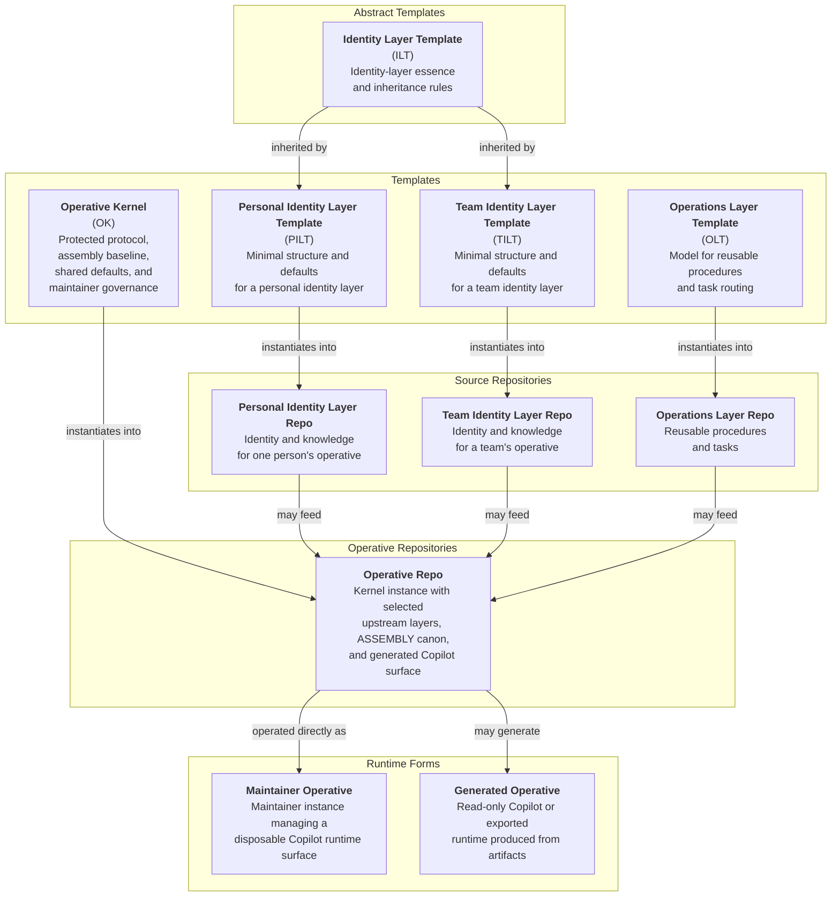

# Operatives Architecture

An Operative is a durable AI system defined by its operative files. This document describes the intended final architecture of the system: what the core entities are, how they relate, and how an Operative is assembled, maintained, and exported. In that architecture, Operatives are built for GitHub Copilot in VS Code as the primary runtime, assembled from a kernel plus selected upstream layers, and delivered either as maintainer Operatives or as generated Operatives.

## System Hierarchy

The system is organized around three primary categories: Templates, Layers, and Operatives.

- Templates define reusable structural patterns.
- Layers are concrete canonical sources instantiated from templates.
- Operatives are durable systems instantiated from the kernel and composed from selected layers.

Templates are scaffolding for building layers. Operatives are assembled by attaching layers to a kernel.

Within that hierarchy, the kernel is the template for an Operative. `ILT` is an abstract template family definition and is not intended for direct instantiation. `PILT`, `TILT`, `OLT`, and `OK` are concrete templates intended for direct instantiation. Templates instantiate into Layers, except for the kernel, which instantiates directly into Operatives. Layers then compose into Operatives. Runtime instances are assembled forms of an Operative rather than equal-status host embodiments.

### System Diagram

## Template Families

### Operative Kernel

The kernel is the universal template for an Operative. Every Operative begins as an instance of the kernel and inherits the operative-level contract defined by `PROTOCOL` together with the adjacent routing, governance, assembly, task, and update surfaces that make that contract usable.

The kernel defines the minimum shared structure of an Operative. It also owns the default maintainer-governance model for maintainer Operatives.

At the operative level, the kernel provides the required operative file family: the protected `PROTOCOL` surface together with the adjacent routing, governance, assembly, task, and update surfaces that make an Operative coherent and maintainable as a durable system.

`PROTOCOL` is the hard floor of the operative contract. It is intended to be preserved verbatim rather than edited by layer or Operative maintainers. The rest of the kernel file family routes, interprets, and assembles that contract, but does not override it.

The kernel also owns the baseline rules for governed source editing in maintainer Operatives.

- Maintainer Operatives are the default source-managing runtime form.
- The kernel assumes source editing may occur where a target layer or repo is edit-enabled.
- Per-layer or per-repo edit boundaries still apply and remain authoritative for their targets.
- The kernel does not imply blanket edit authority across every included source.

### Identity Layer Family

`ILT` defines the shared shape of identity layers. Identity layers supply enduring identity, mission, persona, and judgment canon that can be composed into an Operative without losing provenance.

`PILT` and `TILT` are direct descendants of `ILT`. They specialize that shared identity-layer shape for personal and team identity sources while remaining identity layers in the same family.

### Operations Layer Family

`OLT` defines the shared shape of operations layers. Operations layers provide reusable procedures and task-routing canon that an Operative can invoke without treating those procedures as part of its identity.

Maintainer-focused editing workflows are no longer modeled as a separate active template family. That governance now lives in the kernel.

## Operative Lifecycle

### Instantiation And Composition

An Operative begins as an instance of the kernel. It is then composed from selected identity and operations layers, each of which remains a canonical upstream source rather than being flattened into anonymous local canon.

An Operative is defined by its operative files: the files surfaced through its operative-level `INDEX`. Files not surfaced there may still matter as sources, included repo contents, or implementation details, but they are not part of the operative surface.

When directive conflicts arise between operative files and non-operative files, operative files win.

At the maintained-source level, the concrete unit is an Operative repo instantiated directly from `OK`. Included layers remain distinct source repos inside the Operative through pinned inclusion. `ASSEMBLY` is the canonical declarative record of which sources are included, how they relate, and how the resulting Operative should be assembled.

An Operative may include multiple operations layers when needed, provided their routing preserves provenance explicitly through namespaces or equivalent mechanisms.

### Assembly And Artifacts

`assemble-operative` is the canonical workflow for instantiating and refreshing an Operative repo from the kernel, selected upstream layers, and `ASSEMBLY` canon. It does not redefine the Operative. It materializes the Copilot-facing implementation surfaces required to instantiate the operative contract already defined by the kernel and the selected sources.

This yields a durable distinction between source canon, generated artifacts, and local working state.

- Source canon lives in instantiated layer repos and in Operative repo surfaces that act as maintained sources of truth under the kernel contract.
- Generated artifacts are reviewable projections or copies of canon and are not hand-edited as primary sources.
- Local working state belongs in workspace control surfaces and other ephemeral execution context.

GitHub Copilot is the primary runtime target, so the assembly workflow owns the normalization boundary between durable source structure and current Copilot runtime shape.

At minimum, `assemble-operative` is responsible for:

- reading the kernel and selected upstream layers
- resolving precedence and collisions
- asking the maintainer when ambiguity remains
- generating the blended `copilot-instructions.md`
- copying or normalizing runtime artifacts into the assembled `.github/` surface
- keeping generated or copied runtime artifacts visibly distinct from canonical authoring surfaces

Because AI participates in assembly, many Copilot-shape changes can be absorbed in the assembly workflow rather than forcing broad source-repo migrations.

### Runtime Forms

At runtime, an Operative may appear in two forms.

A maintainer Operative is a maintainer instance that manages a disposable Copilot runtime surface from adjacent operative-owned source surfaces and can maintain operative-local canon and edit-enabled upstream canon under kernel governance and target-specific boundaries.

The maintained-source surface for a maintainer Operative lives under `.<operative-name>/`. Included layer sources live under `.<operative-name>/LAYERS/<layer-name>/`. The disposable Copilot runtime surface lives under `.github/` and is generated from the maintained source surface rather than edited as primary canon.

A generated Operative is a read-only runtime produced from prebuilt artifacts. In that form, the deployed unit need not include the full Operative repo, included upstream layer repos, or `ASSEMBLY`; it only needs the runtime-facing artifacts required by the target environment.

This is the live runtime distinction.

- Maintainer Operatives are the first-class maintained runtime form.
- Generated Operatives are the read-only consumption and export form.
- The architecture does not currently maintain a separate first-class runtime category for non-maintainer source Operatives.

### Governed Editing And Maintenance

The kernel provides the default governance for maintaining an Operative's own local operative canon. That local surface includes files such as `ASSEMBLY` that record composition and deployment decisions for the Operative itself.

Included layer repos remain canonical upstream sources. Editing those layer files is governed, not assumed globally.

The kernel carries the maintainer-governance model directly rather than delegating it to a separate active template family.

That governance follows four rules.

- A maintainer Operative may perform governed source edits by default.
- A target layer or repo remains editable only when loaded governance for that target authorizes editing.
- In multi-target workflows, governance applies per target and does not bleed across other targets.
- If a maintainer wants durable divergence from an upstream layer or template, that divergence becomes a forked canonical source rather than an unofficial Operative-local variant.

When an Operative has edit access to a constituent layer, it edits that layer in its canonical repo and pushes or proposes the change upstream there.

Generated Operatives do not carry this source-edit authority by default.

### Update Handling

Operatives include layers as canonical upstream sources, so upstream and downstream evolution remains explicit. Upstream changes are reviewed through AI operative workflows rather than consumed through blind pulls or mandatory synchronization.

The canonical downstream disposition states are `Included`, `Excluded`, and `Deferred`. Repositories that expect selective downstream consumption should publish `09_CHANGELOG_*` as an update ledger designed for that workflow, with enough context for a maintainer to decide whether and how to advance downstream canon.

Downstream tracking should mirror relevant upstream history closely enough for the maintainer and Operative to see what has been included, excluded, and deferred.

Companion artifacts may support review and adoption, but canon remains authoritative over any convenience package.

## Export Model

GitHub Copilot in VS Code is the only first-class live runtime target in this architecture.

Other platforms are represented as export targets rather than as equal-status runtime families.

This means:

- the live product does not promise native parity outside Copilot
- export quality depends on what can be faithfully projected from maintained source canon